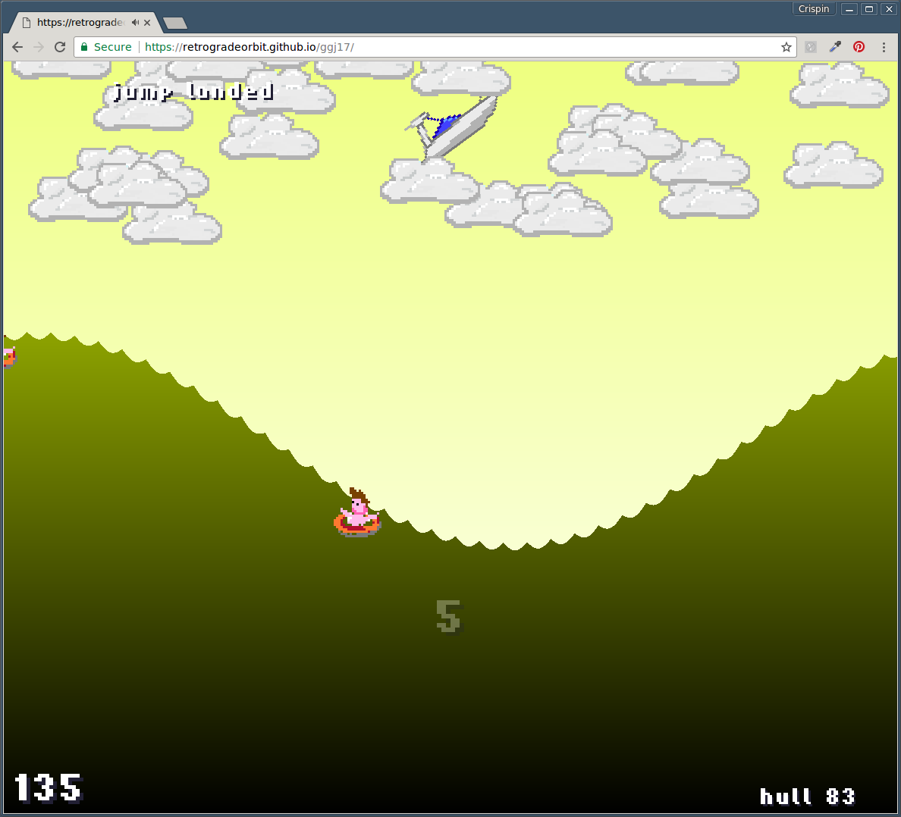

# Tidal Upsurge

Game developed in 48 hours for 2017 Global Game Jam. Developed in ClojureScript using the InfiniteLives gamejam library.

[PLAY IT NOW!](https://retrogradeorbit.github.io/tidalupsurge/)

## Overview

Speed your boat along the waves (left and right arrow keys or left and right on the game controller). Jump over the swimmers to avoid hull damage and jump off the waves (controller button, space or z key) and pull sick tricks (up and down while airborne). Points awarded for landing flips. To land a trick without hull damage, the hull of your boat should align with the surface of the water when you land. Too much hull damage and your boat will explode! 

## Setup

To get an interactive development environment run:

    lein figwheel

and open your browser at [localhost:3449](http://localhost:3449/).
This will auto compile and send all changes to the browser without the
need to reload. After the compilation process is complete, you will
get a Browser Connected REPL. An easy way to try it is:

    (js/alert "Am I connected?")

and you should see an alert in the browser window.

To clean all compiled files:

    lein clean

To create a production build run:

    lein do clean, cljsbuild once min

And open your browser in `resources/public/index.html`. You will not
get live reloading, nor a REPL. 

## License

Copyright © 2017 Crispin Wellington & Tim Metcalf

Distributed under the Eclipse Public License either version 1.0 or (at your option) any later version.
